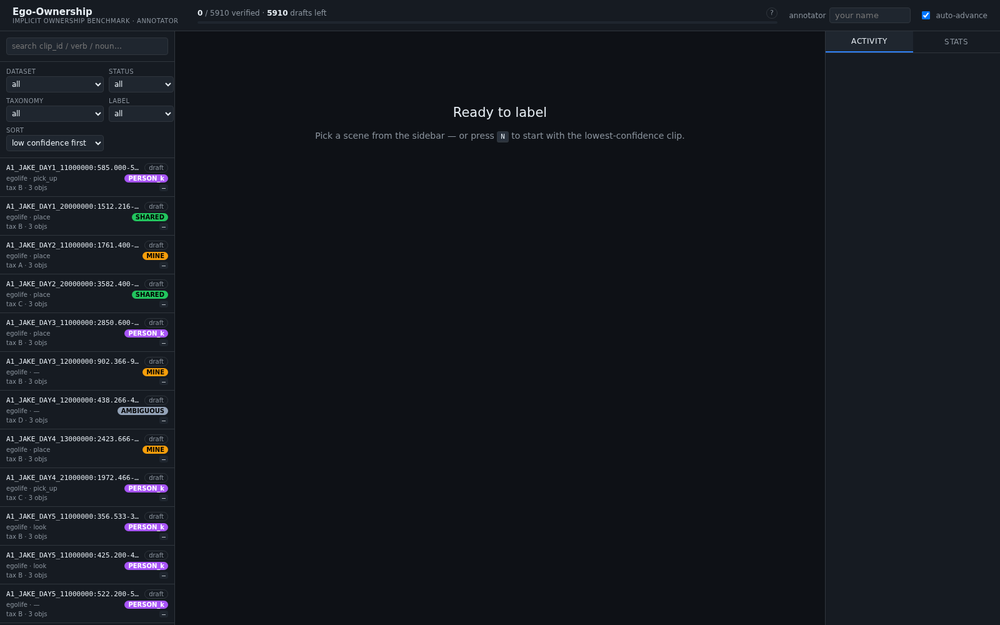
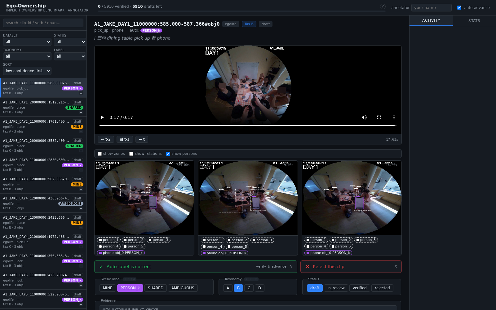
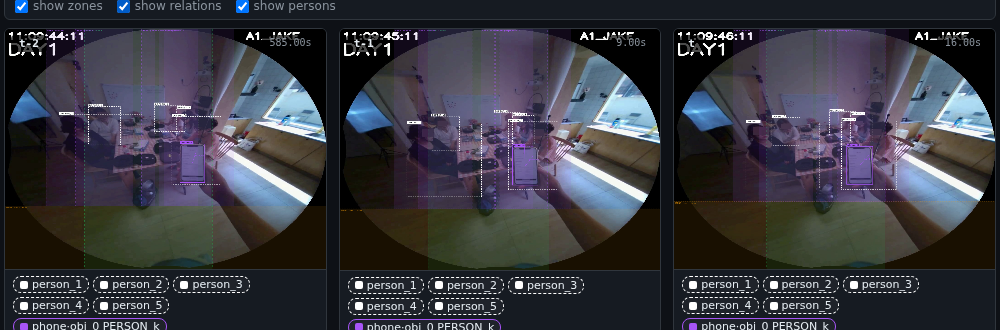
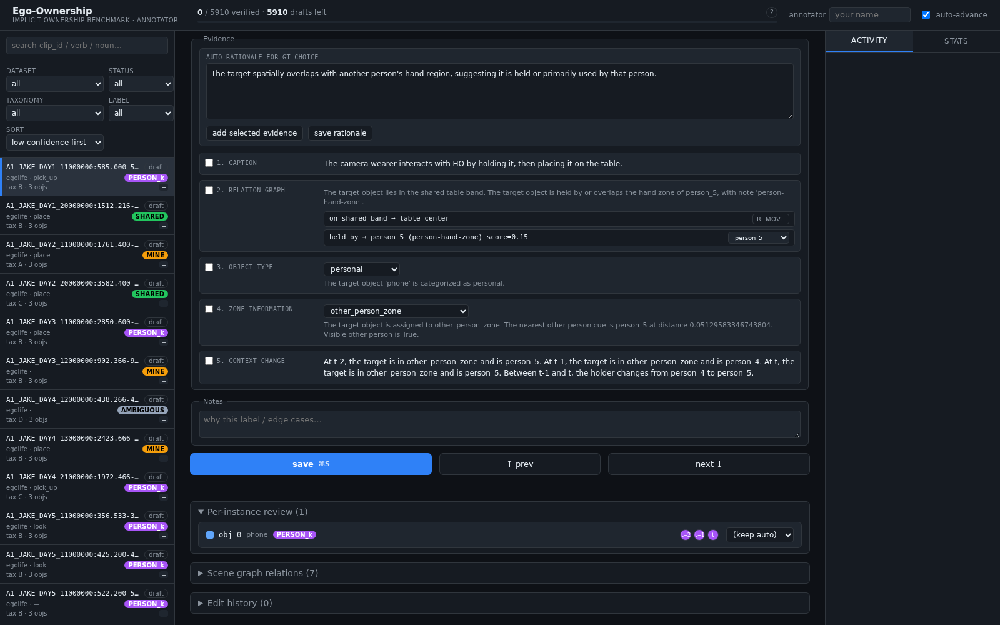
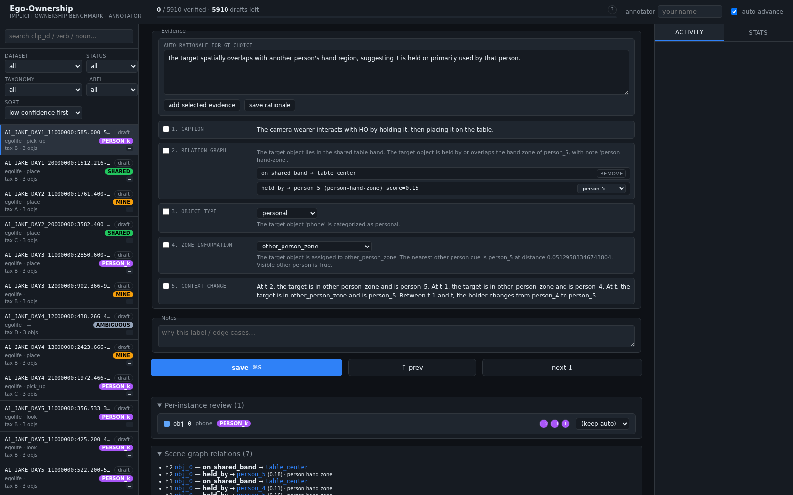
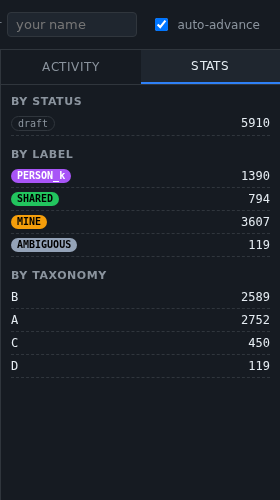

# Human Validation Manual: Reviewing Auto-Labeled Ownership Data

This is a walkthrough of the annotator UI (`egoown serve`) for reviewers validating
`auto_ground_truth` / `auto_taxonomy` labels, plus the recommended validation workflow once
`vlm-crosscheck` results are available for a clip.

For how the labels themselves are computed, see
[auto_labeling_taxonomy_and_gt.md](auto_labeling_taxonomy_and_gt.md). For how the independent
VLM judge works, see `src/egoownership/vlm_crosscheck.py`.

> **Note on current state:** the UI shows the rule-based pipeline's own evidence (§4) and, when
> `egoown serve` is launched with `--crosscheck`, a side-by-side "VLM cross-check" panel with each
> judge's label, its 4 shared evidence fields, and an agree/disagree badge — see §7.

## 1. Launching the server

```bash
egoown serve --input outputs/egolife/labels_v2.jsonl,outputs/ego4d/labels_v2.jsonl --frames-root .
```

Then open `http://localhost:8000`. Multiple `--input` files (comma-separated or repeated) are
merged into one session, filterable by dataset.

## 2. Sidebar: finding what to review



Each row shows `clip_id`, dataset, verb, auto-label, and taxonomy tag at a glance. Use the
filters/sort to target a specific validation slice instead of reviewing top-to-bottom:

- **dataset** — egolife / ego4d / all
- **status** — draft / in_review / verified / rejected
- **taxonomy** — `A` (baseline) / `B` (conflict) / `C` (contextual) / `D` (ambiguous)
- **label** — MINE / PERSON_k / SHARED / AMBIGUOUS
- **sort** — low/high confidence first, or file order

The top bar (`0 / 5910 verified · 5910 drafts left`) tracks overall progress; the **stats** tab
(§7) breaks it down further.

## 3. Scene detail: the evidence for one clip

Clicking a row opens the full detail view:



Top to bottom:

- **Header** — `clip_id`, dataset badge, taxonomy badge, review-status badge.
- **Verb · noun · auto-label** and the **narration** text (the dataset's own caption —
  `dense_caption_en` / transcript — this is ground-truth context, not something the pipeline
  invented).
- **Video player** with `t-2` / `t-1` / `t` jump buttons, so you can scrub to the exact moments
  the three sparse frames were sampled from.
- **Frame grid** (t-2, t-1, t) with detected persons and the target object boxed. Toggle
  **show zones** / **show relations** / **show persons** to overlay the spatial evidence the
  pipeline actually used:



  - Dashed boxes = detected persons (`person_1`, `person_2`, …).
  - Colored bands = the zone geometry (ego zone, shared band, other-person zone).
  - Solid highlighted box = the target object, labeled with its resolved auto-label.

- **Quick actions** — "Auto-label is correct" (verify & advance, shortcut `V`) or "Reject this
  clip" (shortcut `X`) for fast triage of the common case.
- **Scene label / Taxonomy / Status** button groups — manual override, with keyboard shortcuts
  (`1`-`4` for label, `A`-`D` for taxonomy).

## 4. Evidence panel: what the pipeline saw



This is the core of validation — it's a structured breakdown of every evidence category
`_decide_taxonomy_gt` considered, in the same order as `auto_key_evidence`:

1. **Caption** — the actor-cue extracted from narration (e.g. "the camera wearer interacts with
   HO by holding it, then placing it on the table").
2. **Relation graph** — detected `held_by` / `on_shared_band` relations, **editable**: the
   dropdown next to a `held_by` relation lets you reassign the holder (e.g. `person_5` → `wearer`)
   or remove the relation entirely if the detector got it wrong. Changing this **re-derives**
   `auto_ground_truth`/`auto_taxonomy` live via the same rule cascade the pipeline uses, so a
   detector-error fix (not just a label override) propagates correctly.
3. **Object type** — the rule-based classification (`personal` / `shared` / `generic_object`),
   also editable.
4. **Zone information** — which spatial zone the target resolved to, and why (nearest-person
   distance, visibility).
5. **Context change** — the t-2 → t-1 → t narrative: did the zone or holder change across frames.

The **"auto rationale for GT choice"** textbox at the top is the one-sentence summary; checking
boxes next to evidence rows and clicking **add selected evidence** appends their text into it —
useful for building a rationale that cites exactly which evidence you're endorsing/overriding.

Below the evidence panel:

- **Per-instance review** — every detected object instance in the clip (not just the target),
  with its own auto-label and an override dropdown.
- **Scene graph relations** (expandable) — the raw relation list across all three frames:



- **Edit history** (expandable) — an audit trail of every save, who made it, and what changed.

## 5. Stats tab: tracking validation coverage



Breaks the whole (filtered) set down by status, label, and taxonomy — use this to confirm a
validation pass actually covered the slice you intended (e.g. "all taxonomy D rows are now
verified") rather than trusting the sidebar list alone.

## 6. Validation workflow

### 6.1 Triage: what to review exhaustively vs. sample

Once a clip has both `auto_ground_truth` and a `vlm-crosscheck` judgement, use **agreement as a
risk signal**, not a substitute for review:

- **Judge(s) agree with `auto_ground_truth`** → lower risk, but not proof of correctness (a
  matching label can still hide a wrong reason on either side, and a single shared blind spot —
  e.g. the same visual ambiguity — will make both agree and both be wrong). Sample rather than
  reviewing every row, but **stratify the sample** by taxonomy tag and label: `A`-tagged MINE
  rows dominate the dataset and are the least error-prone, while `B`/`C`/`D` and
  PERSON_k/SHARED/AMBIGUOUS rows are rarer and carry more risk — a flat random sample will barely
  touch them. If you ran multiple judges, prefer "all judges agree with each other and with auto"
  over "majority happened to match auto while judges split."
- **Judge(s) disagree with `auto_ground_truth`** → validate all of them. Disagreement is exactly
  where an independent, differently-conditioned reasoner (frames-only, no pipeline evidence)
  catches something the rule cascade got wrong — or vice versa.

### 6.2 What to check, per row

In roughly descending priority:

1. **Final label correctness.** Watch the frames yourself and decide: is `auto_ground_truth`
   actually right? Agreement is a confidence signal, not a verdict.
2. **Aspect-by-aspect reasoning.** Compare the pipeline's evidence (§4: object type / zone /
   relation graph / context change) against the judge's corresponding fields
   (`object_type_evidence`, `zone_evidence`, `relation_graph_evidence`, `context_change_evidence`
   in `crosscheck.jsonl`). A matching label with contradictory reasoning on one side is a signal
   worth flagging even if you don't change the final label — it means the rule engine (or the
   judge) is right for the wrong reason on this row, which matters for trusting it on other rows.
3. **Taxonomy tier correctness.** Independent of whether the final label is right — did the
   auto-labeler pick the correct tier (`A` baseline / `B` conflict / `C` contextual / `D`
   ambiguous) given the evidence actually present?
4. **Target bbox correctness in frame t.**

### 6.3 Recording the outcome

- If the auto-label is correct as-is: **"Auto-label is correct"** quick-action (`V`) — marks
  verified and advances.
- If the auto-label is wrong but the evidence is fine: override the **scene label** / **taxonomy**
  buttons directly, add a one-line **note** explaining why, then **save** (`⌘S`).
- If the auto-label is wrong *because* an underlying detection is wrong (bad relation, wrong
  object type, wrong zone): fix it in the **evidence panel** (§4) so `auto_ground_truth` re-derives
  correctly, rather than just overriding the final label — this keeps the row's evidence and
  label consistent for anyone auditing it later.
- If the clip is unusable (corrupt frame, wrong object entirely, etc.): **"Reject this clip"**
  (`X`).

## 7. `vlm-crosscheck` in the UI

Launch with `--crosscheck outputs/{dataset}/{judge}_crosscheck.jsonl` (repeatable/comma-separated,
same as `--input`) to merge judge results in, keyed by matching `id`:

```bash
egoown serve --input outputs/egolife/labels_v2.jsonl \
             --crosscheck outputs/egolife/claude_crosscheck.jsonl
```

This adds, without touching the auto pipeline's own fields:
- A **"VLM cross-check" panel** below §4's evidence panel — each judge's label plus its 4 shared
  evidence fields (`object_type_evidence`, `zone_evidence`, `relation_graph_evidence`,
  `context_change_evidence`), numbered to match §4's rows (2-5) for easy side-by-side reading.
  Each evidence row has its own checkbox, feeding into the same "add selected evidence" action as
  §4's — you can mix-select from either side into the rationale.
- A **header badge** ("VLM: agrees"/"disagrees"), a **sidebar ✓/✗ pill** per clip, and a
  **"vlm agreement" sidebar filter** (agree / disagree / no VLM data) — this is what operationalizes
  the §6.1 triage directly from the sidebar, no manual file-joining needed.
- When nobody has curated a selection yet for a row, the rationale textarea and both panels'
  checkboxes **default to whichever aspects both the auto pipeline and an agreeing judge actually
  wrote something about** — evidence "supported by two independent modes." This is a starting
  point, not a verdict: you can always edit before saving.

## 8. Egolife validation pass — sampling record (2026-07-07)

Once `vlm-crosscheck` (`claude-sonnet-4-6`) finished for all 888 egolife rows (agree=464,
disagree=424, no_data=0), this is how the first validation pass's worklist was chosen, per §6.1:

- **Stratified sample of the agree bucket**: per `(taxonomy, scene_label)` cell, sampled
  `max(5, ceil(15% × n))` (capped at `n`) — a floor so small cells (e.g. `C`/`SHARED`, n=11) aren't
  reduced to 1-2 rows by a flat percentage. Fixed random seed (`42`) for reproducibility.
- **All of the disagree bucket** included per §6.1 (no sampling — disagreement is exactly the
  higher-risk signal that warrants full review).
- Resulting worklist: **507 rows → `review_status = in_review`** (83 sampled-agree + 424
  disagree). These are exactly what the sidebar's `in_review` status filter shows.
- The remaining **381 non-sampled agree rows → `review_status = verified`**, but tagged
  `annotator: "auto-sampling"` with a note ("accepted via stratified VLM-agreement sampling —
  not directly reviewed") in their edit history — distinguishable from a row a human actually
  looked at (which would show a real annotator name and no such note). This keeps the sidebar's
  `draft` bucket meaning "nothing has looked at this yet" without conflating "reviewed by a person"
  and "accepted by policy" under the same status.
- Per-cell counts:

  | taxonomy/label | n | sampled |
  |---|---|---|
  | A/MINE | 150 | 23 |
  | A/SHARED | 20 | 5 |
  | B/MINE | 189 | 29 |
  | B/PERSON_k | 12 | 5 |
  | B/SHARED | 37 | 6 |
  | C/MINE | 31 | 5 |
  | C/SHARED | 11 | 5 |
  | D/AMBIGUOUS | 14 | 5 |

This same recipe (stratify agree by taxonomy×label with a 15%/floor-5 rule, take all disagree,
mark the rest verified-by-policy) should be re-run for ego4d once its `vlm-crosscheck` is available.
